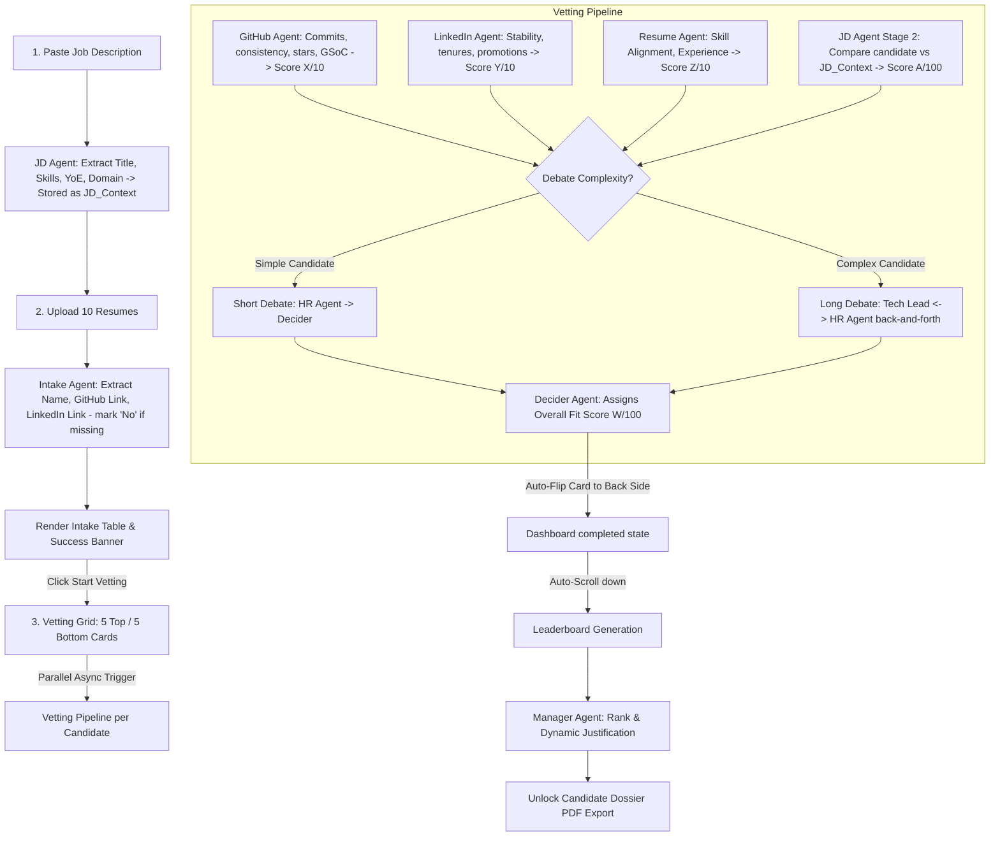

# Final Implementation Plan - PanelAI Recruiter

PanelAI is an autonomous, multi-agent recruitment matching system. It takes a raw Job Description and a batch of 10 PDF resumes, parses them, auto-discovers links, runs parallel evaluation agents, triggers a conditional panel debate, and ranks the candidates on a dynamic leaderboard.

---

## 1. Complete System Architecture & Agent Flow



---

## 2. In-Depth Step-by-Step Execution Workflow

### Phase 1: Intake & Setup
1. **Job Description Input:**
   * Recruiter pastes raw copy-pasted JD text.
   * **JD Agent (Stage 1)** parses the text in the background. It extracts:
     * `target_title`: e.g. "Senior React Developer"
     * `required_skills`: e.g. `["React", "TypeScript", "Node.js"]`
     * `preferred_skills`: e.g. `["Next.js"]`
     * `required_experience`: e.g. `4` (in years)
     * `domain`: e.g. `"SaaS"`
   * These parameters are stored in the global context variable `JD_Context`.
2. **Resume PDF Upload:**
   * Recruiter uploads 10 PDF files.
   * **Intake Agent** runs in the background:
     * Parses PDF text to extract Candidate Name.
     * Scans PDF text using regex and LLM for GitHub and LinkedIn URLs.
     * **Constraint:** If a URL is not found in the resume, it writes `"No"` or `"None"`. No web search is performed.
3. **UI Ingestion Table:**
   * Renders a clean grid: `Name` and then 3 buttons in a row: `[GitHub]` `[LinkedIn]` `[View Resume PDF]`.
   * Shows a success banner: `"10 Candidate details fetched successfully. Ready to analyze?"`
   * Displays the action button: `"Start Vetting Panel"`.

### Phase 2: Live Parallel Vetting (Evaluating State)
4. **Vetting Grid Initialization:**
   * When clicked, the page shows a **5x2 Grid of Cards** (5 cards on top, 5 on bottom).
   * All 10 cards start in their **Evaluating State (Front Side)**.
   * The backend fires 10 asynchronous tasks concurrently. The total vetting time is ~30–45 seconds.
5. **Evaluating Card UI (Front Side Details):**
   * **Visual Indicators:**
     * A pulsing status dot showing who has the floor (`GitHub Analyzing` (Blue) -> `LinkedIn Vetting` (Light Blue) -> `Resume Scanning` (Amber) -> `Panel debating` (Violet) -> `Decider Finalizing` (Green)).
     * A 1-line dynamic text ticker showing a live preview of what the active agent is saying (e.g. *"Tech Lead: 'GSoC work is impressive...'"*).
     * An SVG Radar Chart outline. As each agent finishes, its corresponding vertex on the radar chart stretches outward.
6. **Detailed Vetting Chat Sequence (Dynamic Logs):**
   * The user can click a candidate card to slide open a **WhatsApp/Slack-style drawer chat**:
     * **Message 1 (GitHub Agent):** Evaluates commits, consistency, stars, GSoC. Outputs: *"Based on GitHub, I give this candidate X/10."*
     * **Message 2 (LinkedIn Agent):** Evaluates job tenures, stability, promotions. Outputs: *"Based on LinkedIn, I give this candidate Y/10."*
     * **Message 3 (Resume Agent):** Evaluates CV text and alignment. Outputs: *"Based on the Resume, I give this candidate Z/10."*
     * **Message 4 (JD Agent Stage 2 - Alignment Evaluation):**
       * Receives `JD_Context` and the outputs of the GitHub, LinkedIn, and Resume agents.
       * Calculates the **JD Alignment Score** using the formula:
         $$JD\_Score = (Required\_Skills\_Match \times 0.50) + (Experience\_Match \times 0.20) + (Preferred\_Skills\_Match \times 0.15) + (Domain\_Match \times 0.15)$$
       * Generates a dynamic natural language review summarizing matched/missing skills, experience, and domain alignment.
       * Outputs structured JSON matching the schema below.
     * **Conditional Debate Loop:**
       * *Simple Candidate:* The assessor agents submit reviews. The HR Agent makes a short review statement, and the Decider concludes immediately.
       * *Complex Candidate:* The Tech Lead (focused on code/projects) and HR Agent (focused on stability/tenure) engage in a back-and-forth debate of up to 6 turns before reaching a consensus.
     * **Decider Agent:** Concludes the debate and outputs the final consensus score (W/100).
7. **Auto-Flip:**
   * Once the Decider outputs the score, the candidate card automatically triggers a smooth 3D flip animation to reveal the **Back Side (Fit Score)**.

### Phase 3: Leaderboard & Interactive Hover
8. **Auto-Scroll to Leaderboard:**
   * Once all 10 cards have flipped to their Back Side, the page automatically scrolls down smoothly to reveal the final **Leaderboard Section**.
9. **Leaderboard Table:**
    * Shows ranks 1 to 10:
      * `Rank | Candidate Name | Fit Score | JD Alignment Score | Recruitability Verdict | Manager's Justification`
      * *Manager's Justification:* A short, dynamic 1-sentence explanation of why they earned this rank, generated dynamically by the **Manager Agent**.
10. **PDF Export:**
    * A button unlocks to download the PDF candidate dossier containing the ranking table, links, and detailed reviews.
11. **Post-Vetting Hover Flip Logic:**
    * If the recruiter scrolls back up to inspect the cards:
      * **Default State:** The card rests on the **Back Side**, displaying the overall score (e.g., `88/100`).
      * **Hover State:** When hovered, the card smoothly flips to the **Front Side** (fully populated: radar chart fully drawn, indicators show green checkmarks `[✓]` next to all stages, and a glowing **"View Chat Logs"** button).
      * **Mouse Leave:** Flips back to show the overall score.

---

## 3. JD Agent Specifications (Stage 2 Alignment)

### A. Core Mathematical Formula
* **Required Skills (50%):** Percentage of mandatory stack met.
* **Experience (20%):** Ratio of candidate YoE compared to required YoE (capped at 100%).
* **Preferred Skills (15%):** Percentage of preferred stack met.
* **Domain Match (15%):** Binary or scaled match of target business domain (e.g. SaaS).

$$JD\_Score = (Required \times 0.50) + (Experience \times 0.20) + (Preferred \times 0.15) + (Domain \times 0.15)$$

### B. Output Schema
```json
{
  "jd_alignment_score": 82,
  "matched_skills": ["React", "TypeScript", "Node.js"],
  "missing_skills": ["Next.js"],
  "experience_match": 87,
  "domain_match": 100,
  "jd_review": "The candidate demonstrates strong alignment with the role requirements. All mandatory technologies including React, TypeScript, and Node.js were identified across the resume and project portfolio. The only notable gap is the absence of Next.js experience. Domain experience aligns strongly with SaaS requirements. Overall JD Alignment Score: 82/100."
}
```

---

## 4. Final MVP Agent Lineup

1. **Agent 1: JD Agent:** Parses raw Job Description text to establish `JD_Context` (Stage 1) and evaluates candidate match profiles (Stage 2).
2. **Agent 2: Intake Agent:** Extracts candidate details and profile links from resumes.
3. **Agent 3: GitHub Agent:** Vets repository quality, stars, commits, and GSoC history.
4. **Agent 4: LinkedIn Agent:** Evaluates job durations, stability, and career progression.
5. **Agent 5: Resume Agent:** Scans resume text for skill alignment.
6. **Agent 6: HR Agent:** Vets candidate soft skills, stability, and team fit during the debate.
7. **Agent 7: Tech Lead Agent:** Vets candidate technical execution during complex debates.
8. **Agent 8: Decider Agent:** Synthesizes evaluations and assigns the overall fit score.
9. **Agent 9: Manager Agent:** Ranks candidates on the leaderboard and generates dynamic justifications.
